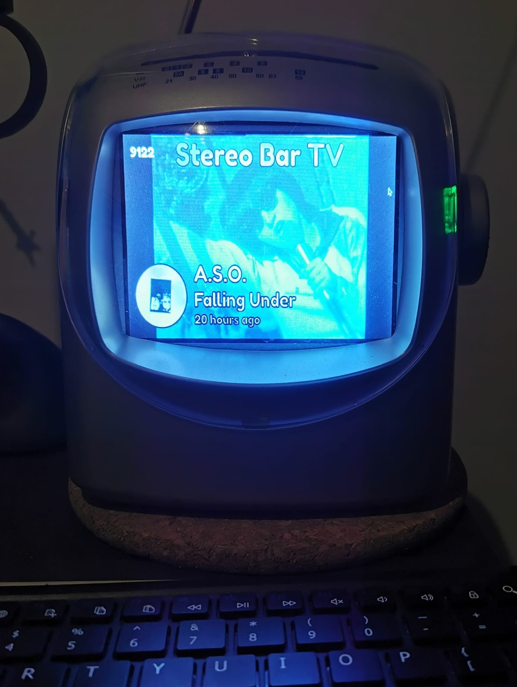

StereoBar TV 📺

StereoBar TV is a Solid.js web application that runs on an Android TV browser connected to a mini CRT TV. 
By default, it plays a YouTube playlist and uses the last.fm API to overlay the current song playing on Spotify.

You can also play games using a Nintendo NES emulator and use your phone as a controller. 
The connection between the phone and the webpage is established using WebRTC, with no webserver involved.

